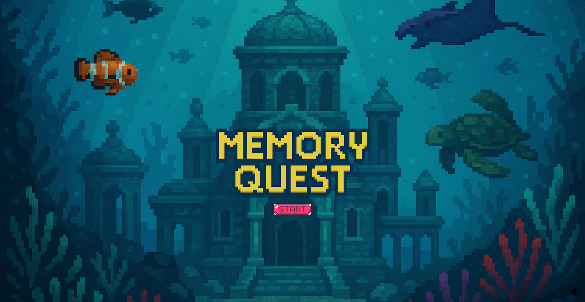
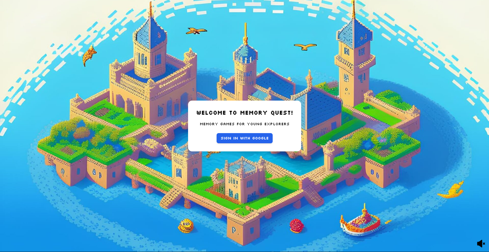
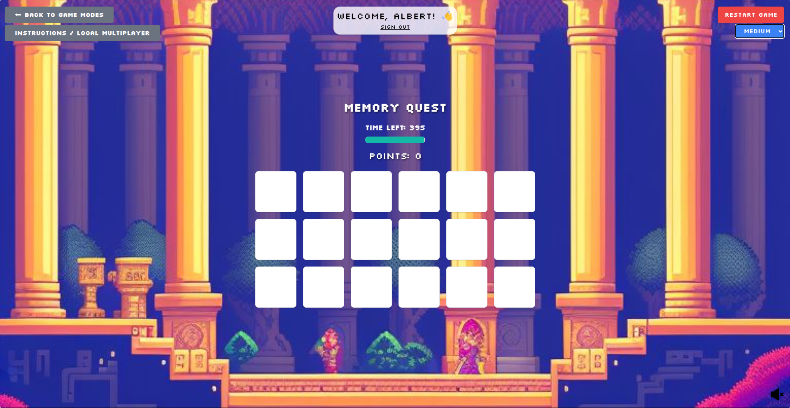
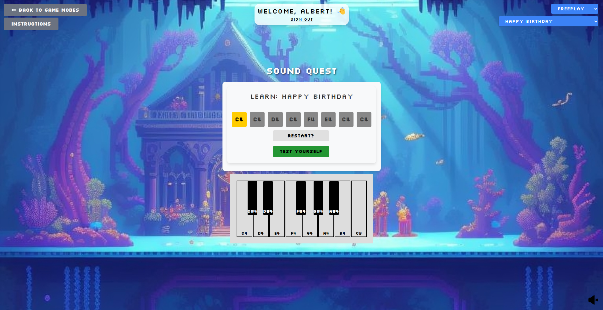
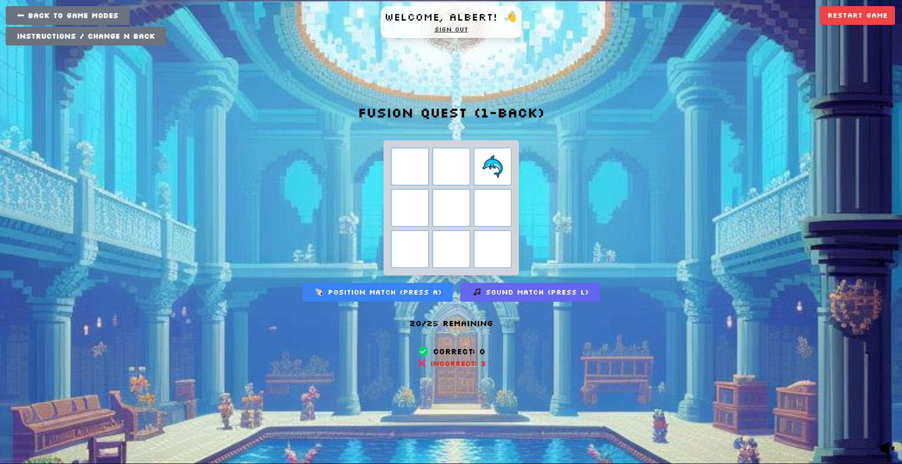
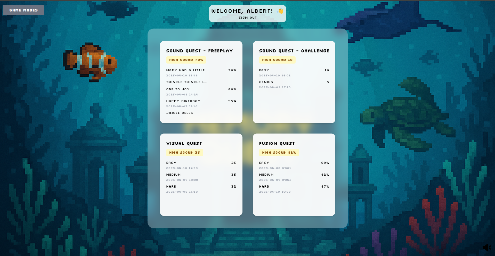

# 🧠 Memory Training App

> A fun, interactive, and educational memory-training web app for children — combining visual and auditory challenges to enhance focus, memory, and learning! 

---

## 📖 Table of Contents
- [Overview](#overview)
- [Features](#features)
- [Tech Stack](#tech-stack)
- [Game Modes](#game-modes)
- [Design Decisions](#design-decisions)

---

## Overview

The **Memory Training App** helps young children develop strong memory and attention skills through interactive **visual and sound-based games**.

Players can:
- Flip cards to match pairs   
- Remember piano note sequences   
- Adjust difficulty levels as they improve  
- Compete against friends or their own best scores   
- Track their progress via an in-game dashboard   

Built with **React**, **Tailwind CSS**, and **Firebase**, this project provides a modular and scalable foundation for educational gaming.

Access it at: https://fyp-project-d6e01.firebaseapp.com/ 

---

## Features

- Visual memory and sound memory games  
- Adjustable difficulty levels  
- Modular architecture for adding new game modes  
- Multiplayer & local multiplayer support  
- Progress tracking dashboard  
- Firebase Authentication + Firestore integration  

---

## Tech Stack

| Layer | Technology |
|-------|-------------|
| **Frontend** | React + Vite |
| **Styling** | Tailwind CSS |
| **Backend / Auth / Database** | Firebase (Auth, Firestore) |
| **Language** | JavaScript / JSX |

---

## Game Modes

### **Visual Memory** 🧩

- Classic card-matching game to train visual recall.

- Single-player and local multiplayer modes.

- Local multiplayer uses hidden turns and fairness rules (e.g., extra turn on correct match).

### **Sound Memory (Piano)** 🎵

Three submodes:

1. Freeplay Mode — Explore piano sounds freely.

2. Challenge Mode — Listen to a sequence and repeat it (difficulty increases).

3. Learn New Songs — Select a song, learn via guided notes, then test memorization.

### **Fusion Mode (Sound + Visual)** 🌊

- Ocean-themed Dual N-Back cognitive training game.

- Adjustable N values.

- Mixes visual grid and audio cues.

### **Dashboard** 📊

- Tracks performance across game modes: high scores, recent attempts, progress trends.

## Design Decisions

- Modular components to make adding features simple.

- Tailwind CSS for rapid, responsive UI development (important for child-friendly layouts).

- Firebase for authentication and real-time persistence.

- Fair multiplayer logic (hidden turns, extra-turn-on-success) to mitigate local device advantage.

- UX focuses on clear visual cues, audio feedback, and simple flows for children.
